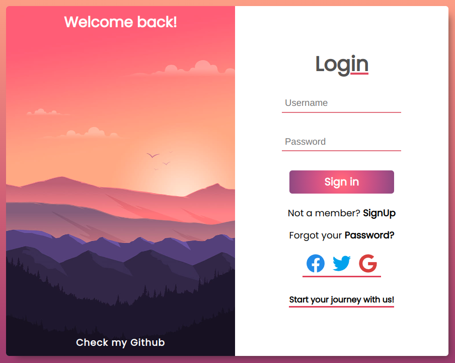
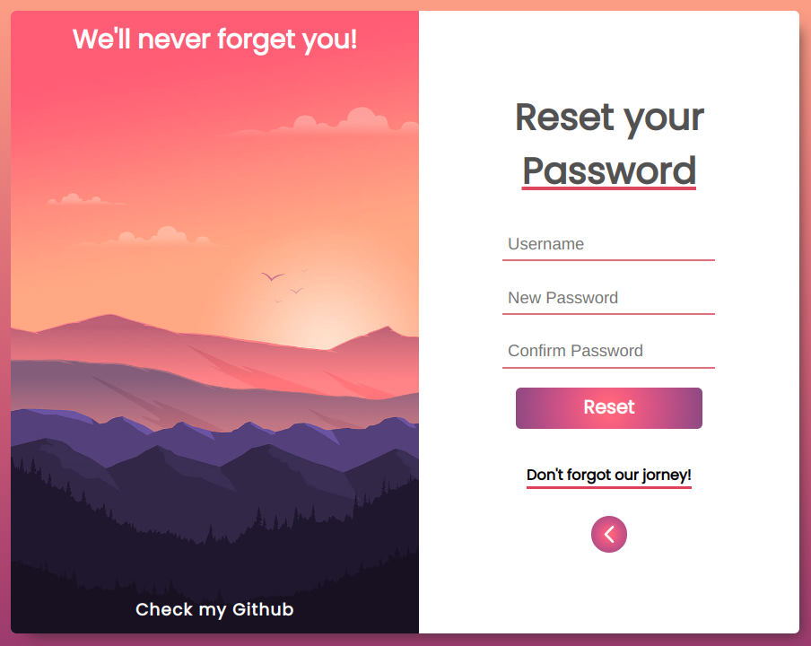
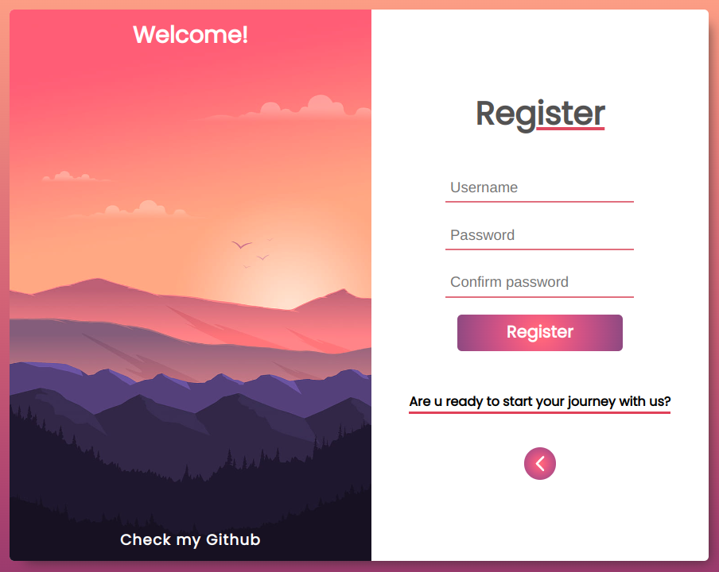
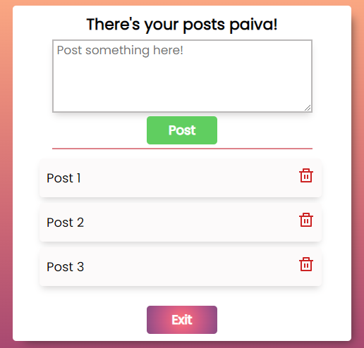

<h1 align="center">Login Page (React/Redux)</h1>

### Available features:
- Register functionality
- Change password functionality
- Same username registered validation
- Login/password validation
- To Do List saved by username (Local host used)

### See online on: https://login-page112.netlify.app/login

